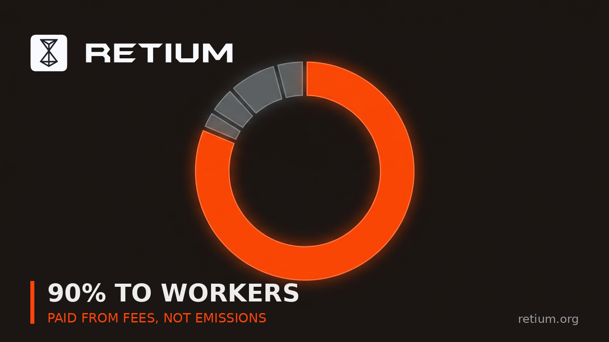

# Day 25 · VALIDATOR ECONOMICS WITH 0% INFLATION: MODEL FEE VOLUME, NOT EMISSIONS

> **Week 4** · Day 25 · Retium X Community Post · Required #3 · Sep 10 2026 · 2264 chars · X post for @RetiumChain

**Goal:** Lay out the fee-funded security budget and what it implies.

## 📋 Post — copy & paste

```text
most token reward models share one hidden assumption: that new tokens will keep being issued to pay for security. Retium removes that assumption, and it changes the economics more than people expect.

here's the setup.

$RTM has a fixed supply of 1 billion with 0% inflation. no minting beyond genesis. no admin key, governance vote or emergency function can change that.

so validators are paid entirely from real transaction fees. not emissions. not a treasury unlocking on a schedule. fees.

the distribution per finalized block:

90% → Workers
5% → Foundation
3% → Keepers
1% → protocol burn
0.5% → Suits
0.5% → Treasury

three things follow from this that I don't see discussed enough.

𝟭. 𝘀𝗲𝗰𝘂𝗿𝗶𝘁𝘆 𝘀𝗽𝗲𝗻𝗱 𝘁𝗿𝗮𝗰𝗸𝘀 𝘂𝘀𝗮𝗴𝗲, 𝗻𝗼𝘁 𝗲𝗺𝗶𝘀𝘀𝗶𝗼𝗻𝘀
on an inflationary chain, validator revenue is set by the emission schedule whether or not anyone is using the network. here, revenue is a function of actual fee volume. the security budget and the usage of the chain can't quietly diverge.

𝟮. 𝘁𝗵𝗲 𝗹𝗮𝗿𝗴𝗲𝘀𝘁 𝘀𝗵𝗮𝗿𝗲 𝗴𝗼𝗲𝘀 𝘁𝗼 𝘁𝗵𝗲 𝗹𝗼𝘄𝗲𝘀𝘁 𝗯𝗮𝗿𝗿𝗶𝗲𝗿
Workers need 10,000 RTM. Suits need 100,000. Keepers need 1,000,000. the tier with the lowest capital requirement receives 90% of rewards. that inverts the usual pattern where reward weight follows stake weight and compounding concentrates the top.

𝟯. 𝘁𝗵𝗲𝗿𝗲 𝗶𝘀 𝗻𝗼 𝘁𝗲𝗿𝗺𝗶𝗻𝗮𝗹 𝘀𝘂𝗯𝘀𝗶𝗱𝘆 𝗽𝗿𝗼𝗯𝗹𝗲𝗺
chains that fund security from emissions eventually have to answer "what happens when the subsidy ends?" that question doesn't exist here, because there was never a subsidy. the model has to work on fees from the first block — and if it doesn't, that's visible immediately rather than deferred.

the honest tradeoff: early on, when fee volume is low, validator income is low. that is the cost of not inflating. the bet is that predictable, low, USD-denominated fees generate enough volume to fund security, rather than a small number of expensive transactions funding it.

worth noting the burn sits inside the distribution rather than bolted on: 1% of each finalized block's reward allocation is permanently burned, so usage applies deflationary pressure continuously instead of through occasional discretionary burns.

if you're modelling validator economics on Retium, model fee volume. there is no other input.

wallet.retium.org

@RetiumChain
```

## 🖼 Image



**File:** `day-25-validator-economics-no-inflation.png` — same name as this post. GitHub: click file → *Download raw file*. Phone: long-press image → Save.

## 🎨 Visual notes

Ring chart with one dominant orange segment. Mirrors the 90% Worker share against the smaller Foundation, Keeper, burn, Suit and Treasury slices.

## 🏆 Score

- Not scored yet — fill this in when the scorer posts results.

## 🚀 Status

- [x] Text ready · - [ ] Posted on X — *Day 25, Week 4*
