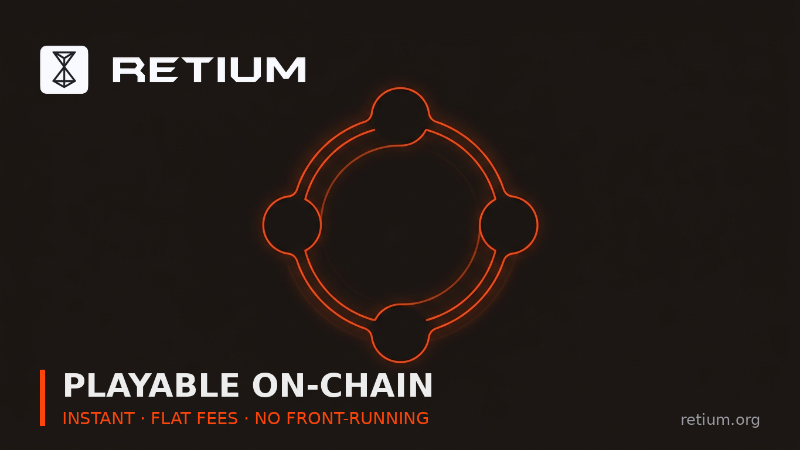

# Day 27 · RETIUM FOR GAMING: WHY THE CHAIN STOPS BEING THE REASON THE GAME FEELS BAD

> **Week 4** · Day 27 · Additional Post #1 (Bonus) · Bonus · Sep 12 2026 · 2336 chars · X post for @RetiumChain

**Goal:** Show that instant finality + known fees + no mempool + WASM is a combined unlock.

## 📋 Post — copy & paste

```text
"blockchain gaming" has a persistent problem, and it isn't the idea. it's that the chain is usually the reason the game feels bad.

you need fast state updates and you get probabilistic finality. you need cheap repeated actions and you get a fee that spikes with congestion. you need fair ordering and you get a mempool where your players' transactions sit visible before they settle.

Retium's architecture happens to remove all three at once, and I don't think that's been spelled out for game developers.

𝟭. 𝗳𝗶𝗻𝗮𝗹𝗶𝘁𝘆 𝘁𝗵𝗮𝘁 𝗶𝘀𝗻'𝘁 𝗽𝗿𝗼𝗯𝗮𝗯𝗶𝗹𝗶𝘀𝘁𝗶𝗰
a transaction executed on Retium is confirmed as soon as its assigned 5-Worker quorum reaches matching approval. Suits then verify and push the block to HardFinal — mathematically irreversible settlement, not "wait N blocks and hope."

for a game, that's the difference between granting the item the moment the quorum confirms, and adding a confirmation buffer because the chain might reorganise underneath you.

𝟮. 𝗳𝗲𝗲𝘀 𝘁𝗵𝗮𝘁 𝗱𝗼𝗻'𝘁 𝘀𝗽𝗶𝗸𝗲 𝘄𝗶𝘁𝗵 𝘆𝗼𝘂𝗿 𝘀𝘂𝗰𝗰𝗲𝘀𝘀
fees are weight-based: Weight 1 is $0.01 for a simple transfer, Weight 5 is $0.45 for heavy computation, USD-denominated and converted through an oracle rate. no gas auctions, no congestion pricing.

a session that costs $0.05 when you have a hundred players costs the same when you have a hundred thousand. your unit economics don't degrade as you grow.

𝟯. 𝗻𝗼 𝗺𝗲𝗺𝗽𝗼𝗼𝗹 𝗺𝗲𝗮𝗻𝘀 𝗻𝗼 𝗳𝗿𝗼𝗻𝘁-𝗿𝘂𝗻𝗻𝗶𝗻𝗴 𝘀𝘂𝗿𝗳𝗮𝗰𝗲
transactions don't enter a public pending queue. the signed payload transmits directly to the Router and into an active open block within PrimeMesh. no public staging means nothing to watch, reorder or sandwich.

for item drops, auctions and competitive craft orders, that removes an entire category of exploit rather than mitigating it after the fact.

𝟰. 𝘆𝗼𝘂 𝗰𝗮𝗻 𝘄𝗿𝗶𝘁𝗲 𝗶𝘁 𝗶𝗻 𝘀𝗼𝗺𝗲𝘁𝗵𝗶𝗻𝗴 𝘁𝗵𝗮𝘁 𝗶𝘀𝗻'𝘁 𝗮 𝗯𝗹𝗼𝗰𝗸𝗰𝗵𝗮𝗶𝗻 𝗱𝘀𝗹
contracts compile to WASM, which means Rust, AssemblyScript or C. if your game is already Rust, your on-chain logic and your client can share a language and a toolchain.

put together: immediate confirmation, a known per-action cost, no ordering attacks, and a contract language your engine team already knows. none of those is unique on its own. having all four is what makes "playable on-chain" a design target instead of a compromise.

the testnet is live if you want to profile it.

wallet.retium.org

@RetiumChain
```

## 🖼 Image



**File:** `day-27-retium-for-gaming.png` — same name as this post. GitHub: click file → *Download raw file*. Phone: long-press image → Save.

## 🎨 Visual notes

Four-node loop carrying a continuous orange circuit, suggesting an unbroken game loop. Deliberately no controller and no characters — the rule is no people, no faces.

## 🏆 Score

- Not scored yet — fill this in when the scorer posts results.

## 🚀 Status

- [x] Text ready · - [ ] Posted on X — *Day 27, Week 4*
