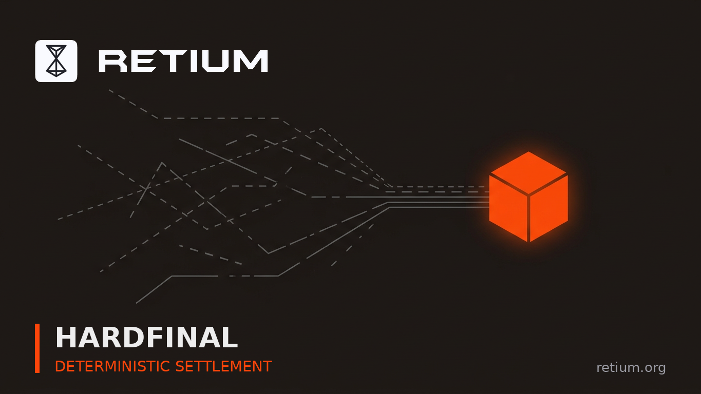

# Day 28 · HARDFINAL AND THE SETTLEMENT USE CASES IT UNLOCKS

> **Week 4** · Day 28 · Additional Post #2 (Bonus) · Bonus · Sep 13 2026 · 2316 chars · X post for @RetiumChain

**Goal:** Frame deterministic settlement as the thing auditors and RWA need.

## 📋 Post — copy & paste

```text
finality is one of those blockchain words that stays abstract until you're the person who has to explain it to a finance team.

"wait six confirmations" is a hard thing to build a settlement process on. so is "probabilistically final, with a small chance of reorganisation." most chains ask a business to accept a probability and write a policy around it.

Retium's HardFinal removes the probability, and that opens use cases which have otherwise been stuck in pilot.

what HardFinal actually is: a transaction is executed by a dynamically assigned 5-Worker quorum and confirmed when that quorum reaches matching approval. Suits — the 100,000 RTM tier — then verify, coordinate finality, and push the block into HardFinal, a deterministic settlement checkpoint immune to chain reorganisation.

there is no epoch to wait for and no validator vote to relitigate. once it is HardFinal, it is final.

why that changes what you can build:

𝟭. 𝘀𝗲𝘁𝘁𝗹𝗲𝗺𝗲𝗻𝘁 𝘁𝗵𝗮𝘁 𝘀𝗮𝘁𝗶𝘀𝗳𝗶𝗲𝘀 𝗮𝗻 𝗮𝘂𝗱𝗶𝘁𝗼𝗿
when a transfer is irreversible the moment it settles, reconciliation becomes a lookup instead of a risk assessment. you don't maintain a reorg-window policy that never triggers.

𝟮. 𝗿𝘄𝗮 𝗮𝗻𝗱 𝘁𝗼𝗸𝗲𝗻𝗶𝘀𝗲𝗱 𝗶𝗻𝘀𝘁𝗿𝘂𝗺𝗲𝗻𝘁𝘀
transferring a tokenised instrument on a chain that can reorganise means the legal layer has to account for the chain changing its mind. deterministic settlement lets the legal document and the chain agree.

𝟯. 𝗽𝗮𝘆𝗿𝗼𝗹𝗹 𝗮𝗻𝗱 𝗯𝟮𝗯 𝗽𝗮𝘆𝗺𝗲𝗻𝘁𝘀
a business paying contractors or suppliers needs to know the payment cannot come back. instant finality after the Worker quorum gives you the speed; HardFinal gives you the guarantee for the amounts where speed isn't enough.

𝟰. 𝗻𝗼 𝗳𝗼𝗿𝗸 𝘁𝗼 𝗿𝗲𝘀𝗼𝗹𝘃𝗲
because block positions are determined by prime-number factorization under PNLA, there is no competing path. there is no scenario in which two versions of the same settlement are briefly both true.

the broader point: most L1s offer fast OR certain and ask you to pick. a two-tier model gives you immediate confirmation for user-facing interactions and deterministic settlement for the ones that end up in a ledger — on the same transaction, not via a second chain or a bridge.

if you've been told blockchain settlement is inherently probabilistic, that's a property of specific designs, not of the technology.

wallet.retium.org

@RetiumChain
```

## 🖼 Image



**File:** `day-28-hardfinal-settlement-use-cases.png` — same name as this post. GitHub: click file → *Download raw file*. Phone: long-press image → Save.

## 🎨 Visual notes

Several dashed broken paths on the left converging into one solid sealed orange cube. Visualises probabilistic finality collapsing into deterministic settlement.

## 🏆 Score

- Not scored yet — fill this in when the scorer posts results.

## 🚀 Status

- [x] Text ready · - [ ] Posted on X — *Day 28, Week 4*
